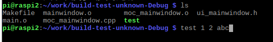

# 知らない単語

## OOP

object-oriented programming

オブジェクト思考プログラミング

## プロセスとスレッド

プロセスは、スレッドの一種。

スレッドは、タスクやプロセスよりも細かい処理の実行単位

#### 継承

継承は、他の定義済みクラスの定義内容を継承して、新しい別のクラスを定義すること。

継承元を基本クラス。継承先を派生クラス

```plantuml

title 継承

基本クラス <|-- 派生クラス1
基本クラス <|-- 派生クラス2

派生クラス1 <|-- 派生クラス3

note right : 基本クラスと派生クラス1の定義内容を継承する

```

#### 多重継承

多重継承は、複数の基本クラスから継承すること

Q . 共通の基本クラスを継承した基本クラスを継承すると、
あいまいさの問題がでるというが何が問題なのかがわからない。

```plantuml

title 多重継承

基本クラス <|-- 基本クラス1
基本クラス <|-- 基本クラス2

基本クラス1 <|-- 派生クラス
基本クラス2 <|-- 派生クラス

note right
  共通の基本クラスを継承した基本クラスを継承すると、
  あいまいさという問題を機解決しなければいけない
end note

```

### main(int argc,char *argv[])

argc 引数の総個数
argv 引数の文字列を指すポインタの配列



↑の画像は、test という実行ファイルを実行するところ。
この場合、 main関数を実行する際の引数には、
argc = 4 , argv = ["test","1","2","abc"]
が入る。

それくらいわかっておけよなぁ・・・。杉浦さんに引かれた。

### evecv と evecl


共通して言えるのは、現在のプロセスを引数1で指定したものに置き換える
引数1 で指定したファイルにパラメータを指定したい場合は、引数2 以降に設定する。

コマンドラインから 実行ファイルを実行する仕方と似ている。
使用する関数によって、argcとargvの中にが異なるので注意!!!

```C++
execl("test","1","2","abc",nullptr);

//  argc = 4 , argv[] = {"test","1","2","abc"}

char * const env[] = {"1","2","abc",nullptr};

execv("test",env);
//  argc = 3, argv[] = {"1","2","abc"}

```
